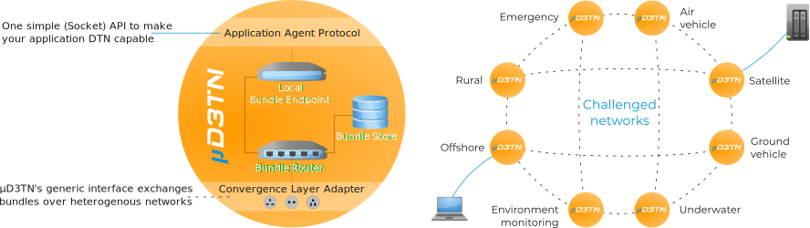

## About

µD3TN (pronounced "Micro-Dee-Tee-En") is a free, lean, and space-tested DTN protocol implementation running on POSIX (plus Linux ;-)) as well as STM32 microcontrollers with FreeRTOS.



A general introduction of µD3TN is available at its project web site at https://d3tn.com/ud3tn.html. µD3TN currently implements:

- Bundle Protocol version 6 ([RFC 5050](https://datatracker.ietf.org/doc/html/rfc5050)),
- Bundle Protocol version 7 ([draft version 31](https://datatracker.ietf.org/doc/html/draft-ietf-dtn-bpbis-31)),
- Several Bundle Protocol convergence layers, such as:
  - MTCP ([draft version 0](https://datatracker.ietf.org/doc/html/draft-ietf-dtn-mtcpcl-00)),
  - TCPCLv3 ([RFC 7242](https://datatracker.ietf.org/doc/html/rfc7242)),
  - CCSDS Space Packet Protocol ([SPP](https://public.ccsds.org/Pubs/133x0b2e1.pdf)).

See [`LICENSE.txt`](LICENSE.txt) and [`LICENSE-3RD-PARTY.txt`](LICENSE-3RD-PARTY.txt) for legal information.

## Pre-compiled binaries

We provide docker images at `registry.gitlab.com/d3tn/ud3tn-docker-images/ud3tn`. Refer to https://gitlab.com/d3tn/ud3tn-docker-images/ for more information.

## Usage

A comprehensive step-by-step tutorial for Linux and POSIX systems is included [in the documentation](doc/posix_quick_start_guide.md). It covers a complete scenario in which two µD3TN instances create a small two-node DTN and external applications leverage the latter to exchange data.

### Start a µD3TN node

For simple setups with just a single node, µD3TN is ready to use with its default settings. For advanced use, the CLI offers at lot of flexibility:

```
Mandatory arguments to long options are mandatory for short options, too.

  -a, --aap-host HOST         IP / hostname of the application agent service
  -b, --bp-version 6|7        bundle protocol version of bundles created via AAP
  -c, --cla CLA_OPTIONS       configure the CLA subsystem according to the
                                syntax documented in the man page
  -e, --eid EID               local endpoint identifier
  -h, --help                  print this text and exit
  -l, --lifetime SECONDS      lifetime of bundles created via AAP
  -m, --max-bundle-size BYTES bundle fragmentation threshold
  -p, --aap-port PORT         port number of the application agent service
  -r, --status-reports        enable status reporting
  -s, --aap-socket PATH       path to the UNIX domain socket of the application agent service
  -u, --usage                 print usage summary and exit

Default POSIX invocation: ud3tn \
  -b 7 \
  -c "tcpclv3:*,4556;tcpspp:*,4223,false,1;smtcp:*,4222,false;mtcp:*,4224" \
  -e dtn://ud3tn.dtn \
  -l 86400 \
  -m 18446744073709551615 \
  -s $PWD/ud3tn.socket
```

The AAP interface can use either a UNIX domain socket (`-s` option) or bind to a TCP address (`-a` and `-p` options).
Examples for `CLA_OPTIONS` are documented in the [man page](doc/ud3tn.1),
which can be viewed with `man --local-file doc/ud3tn.1`.
Default arguments and internal settings such as storage, routing, and connection parameters can be adjusted in [`include/ud3tn/config.h`](include/ud3tn/config.h).

### Configure contacts with other µD3TN / BP nodes

µD3TN performs its bundle forwarding decisions based on _contacts_, which are associated with a specific bundle _node_. Each instance accepts bundles addressed to `<µD3TN_EID>/config` (by default, only via AAP) and parses them according to the specification documented at [`doc/contacts_data_format.md`](doc/contacts_data_format.md). To sum it up, a contact can be used to configure:

- start and end time (optional),
- data rate (optional),
- reliability of the contact (optional), and
- whether the bundle node can reach other nodes during this specific contact (list of EID, optional).

Nodes themselves can be configured (added / removed) via the same syntax and interface.

This repository includes convenient python tools that can be used after [preparing the python environment](doc/python-venv.md) to [configure contacts](tools/aap/aap_config.py).

### Leverage AAP to make applications delay and disruption tolerant

Once a µD3TN enabled DTN network has been created, applications can leverage the custom Application Agent Protocol (AAP) to interact with it. Applications typically use AAP to:

- register themselves at a µD3TN instance with a local identifier,
- inject bundles (hand over a payload and a destination EID to µD3TN, µD3TN then creates a corresponding bundle and tries to forward / deliver it), and
- listen for application data addressed to their identifier.

The protocol is defined at [`doc/ud3tn_aap.md`](doc/ud3tn_aap.md). Like above, there are [dedicated python scripts for various tasks](tools/aap). Python bindings for AAP are available under the name [`ud3tn-utils`](https://pypi.org/project/ud3tn-utils/) in the Python package manager PyPI.

## Develop

### Build

This project uses git submodules to manage some code dependencies. 
Use the `--recursive` option if you `git clone` the project or run
`git submodule init && git submodule update` at a later point in time.

#### POSIX-compliant operating systems

1. Install or unpack the build toolchain
   - Install `make`, `gcc` and `binutils`.
   - For building with Clang, additionally install a recent version of `clang` and `llvm`.

2. Configure the local build toolchain in `config.mk` (optional)
   - Copy `config.mk.example` to `config.mk`.
   - Adjust `TOOLCHAIN` if you want to build with Clang.
   - Adjust `TOOLCHAIN_POSIX` if your toolchain installation is not included in your `$PATH`

3. Run `make run-posix` to build and execute µD3TN on your local machine.

#### STM32

Only the STM32F4 embedded system is supported currently.
However, porting µD3TN to other Cortex-M3/M4 based SoCs should be trivial.

1. Connect the embedded system via STLink-enabled USB.

2. Install or unpack the following dependencies:
   - `gcc-arm-none-eabi` toolchain including `newlib`,
   - [`stlink-tools`](https://github.com/stlink-org/stlink#installation),
   - Open On-Chip Debugger [`openocd`](http://openocd.org/),
   - `ncat`, which is typically available bundled in the `nmap` package,
   - a version of [FreeRTOS](https://www.freertos.org/) (µD3TN is currently
     tested with [version 9](https://github.com/FreeRTOS/FreeRTOS/releases/tag/V9.0.0)).

3. Configure the local build toolchain in `config.mk`:
   - Copy `config.mk.example` to `config.mk`.
   - Set `TOOLCHAIN_STM32` to the prefix for your *arm-none-eabi* toolchain.
     If installed with the distribution's package manager, this is commonly
    `/usr/bin/arm-none-eabi-`.
   - Set `FREERTOS_PATH` to the path to your unpacked FreeRTOS source.

4. Run `openocd` in a terminal. The configuration file [`openocd.cfg`](openocd.cfg) is loaded automatically.

5. Run `make flash-stm32-openocd` to build the project and to flash `ud3tn.bin`
   to the board attached via USB.

### Test

The µD3TN development is accompanied by extensive testing. For this purpose, you should install `gdb` and a recent version of Python 3 (>= 3.6). Our test suite covering static analysis, unit, and integration tests is documented in [`doc/testing.md`](doc/testing.md), which also provides more STM32 debugging instructions.

### Contribute

Contributions in any form (e.g., bug reports, feature, or merge requests) are very welcome! Please have a look at [CONTRIBUTING.md](CONTRIBUTING.md) first for a smooth experience. The project structure is organized as follows:

```
.
├── components             C source code
├── include                C header files
├── external               3rd party source code
├── test                   various test routines
├── doc                    documentation
├── mk                     make scripts
├── dockerfiles            Templates for creating Docker images
├── python-ud3tn-utils     Python bindings for AAP
├── pyd3tn                 Python implementation of several DTN protocols
└── tools                  various utility scripts
```

The entry point is implemented in [`components/daemon/main.c`](components/daemon/main.c).

## Ecosystem

- [`ud3tn-utils`](https://pypi.org/project/ud3tn-utils/) is a Python package that provides bindings for µD3TN's [Application Agent Protocol](doc/ud3tn_aap.md).
- [`aap.lua`](tools/aap.lua) is a Wireshark dissector for µD3TN's [Application Agent Protocol](doc/ud3tn_aap.md). It can be installed by copying it into one of the Lua script folders listed in the Wireshark GUI at `Help > About Wireshark > Folders`.
- [`pyD3TN`](https://pypi.org/project/pyD3TN/) is a Python package that provides implementations of several DTN related RFCs.
- [`aiodtnsim`](https://gitlab.com/d3tn/aiodtnsim) is a minimal framework for performing DTN simulations based on Python 3.7 and asyncio.
- [`dtn-tvg-util`](https://gitlab.com/d3tn/dtn-tvg-util) is a Python package simplifying the analysis and simulation of DTNs based on time-varying network graphs.

## See also

- [RFC 4838](https://datatracker.ietf.org/doc/html/rfc4838) for a general introduction about DTN networks.
- [ION](https://sourceforge.net/projects/ion-dtn/): NASA's bundle protocol implementation that has been successfully demonstrated to be interopable with µD3TN.
