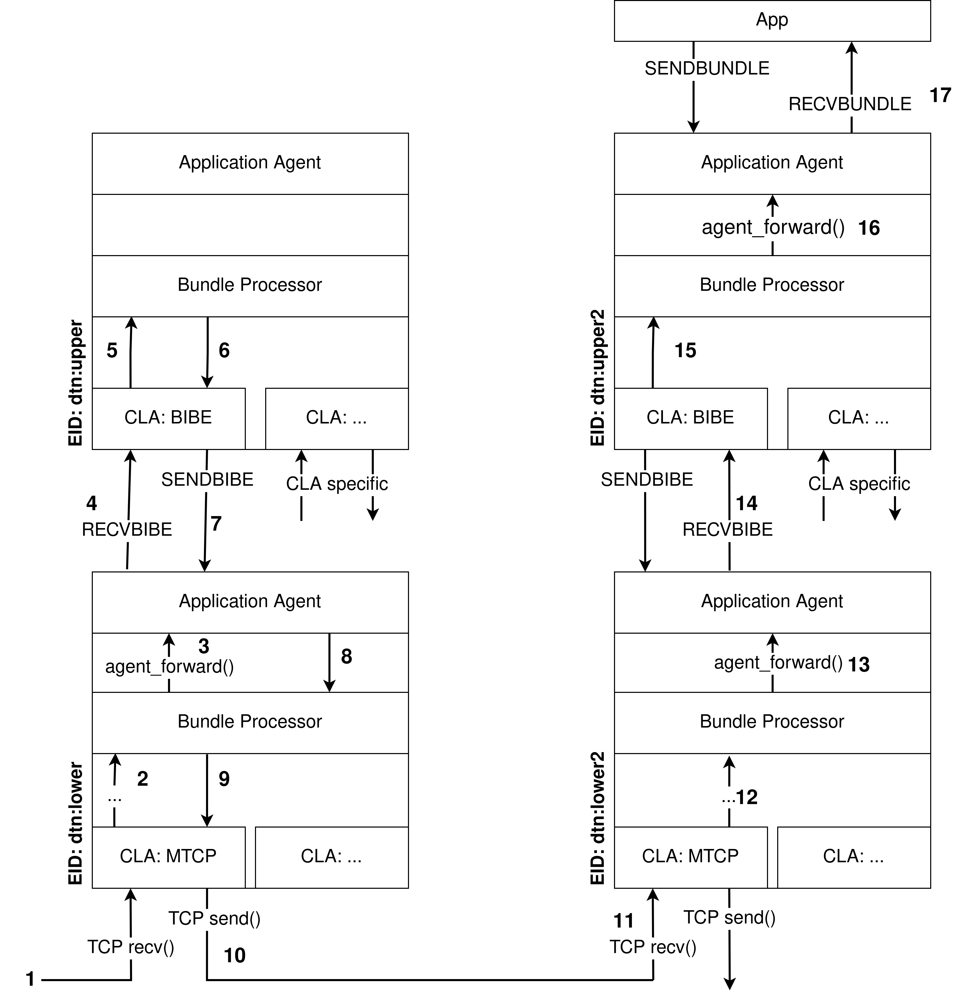
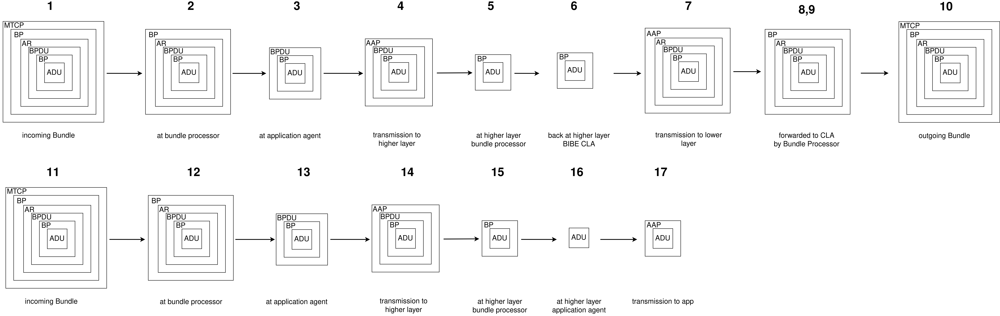

# Bundle-in-Bundle Encapsulation (BIBE) in µD3TN

## What is BIBE?
According to the IETF's Bundle-in-Bundle Encapsulation internet draft, Bundle-in-Bundle Encapsulation (BIBE) is 
> [...] a Delay-Tolerant Networking (DTN) Bundle Protocol (BP) "convergence layer" protocol that tunnels BP "bundles" through encapsulating bundles. The services provided by the BIBE convergence-layer protocol adapter encapsulate an outbound BP "bundle" in a BIBE convergence-layer protocol data unit for transmission as the payload of a bundle.  Security measures applied to the encapsulating bundle may augment those applied to the encapsulated bundle. 

To put it in simpler terms, BIBE allows for sending bundles which themselves contain bundles as payloads. These encapsulated bundles can then for example be encrypted by adding a Bundle Confidentiality Block to the encapsulating bundle, thus providing a better defebse against traffic analysis.

## How does it work in µD3TN?
In µD3TN the processing of BIBE bundles happens on 2 µD3TN instances, one being the lower and one being the upper layer. Whenever the lower layer receives a bundle containing an administrative record of type 3 (or 7 if built using the BIBE_CL_DRAFT_1_COMPATIBILITY flag) - signifying a BIBE protocol data unit (BPDU) - it parses the encapsulating bundle as well as the administrative record and forwards the BPDU to the BIBE CLA on the upper layer via AAP. The upper layer then parses the bundle encapsulated in the BPDU and forwards it to the bundle processor.
From this point on, there are 2 things that may happen:
1. The destination of the encapsulated bundle is an application registered on the upper layer, or
2. The destination of the encapsulated bundle is an application registered on another node
   
If the bundle processor determines that the destination of the bundle is an application registered on the upper layer, it will simply be forward the bundle to this application without any further BIBE related processing.

However, if the bundle processor determines that this node is not the destination of the bundle, it will be forwarded to the next hop. If forwarding happens via the BIBE CLA, the bundle once again gets encapsulated in a new administrative record and sent back to the lower layer using an AAP SENDBIBE message. The application agent of the lower layer then creates a new bundle, the payload of which is the administrative record containing the BPDU, and forwards it to the bundle processor. The bundle processor will then select the CLA to use for forwarding, afer which the bundle will be sent to the next hop. 

This process repeats until the encapsulated bundle reached its destination. The figure below illustrates this process using a setup of 2 nodes.
   
*Fig. 1: A simple two node setup*    
    
 The following figure shows the different layers of a bundle during transit. The numbers above the bundle representations correspond with the steps in figure 1.
      
*Fig. 1: The different stages of bundles* 

## Example setup
To test the capabilities of µD3TN's BIBE implementation, a simple scenario leveradging BIBE to deliver a bundle addressed to an application can be built.

### Step 1: Configuring the µD3TN instances
The setup uses two µD3TN instances running on the same machine to simulate a lower and an upper layer. To start, open a terminal window and run
``build/posix/ud3tn -a localhost -p 4242 -e "dtn://lower.dtn"``
The command will start a local µD3TN instance using the EID "dtn://lower.dtn", listening for AAP messages on localhost:4242. Due to not specifying which CLA to load, this instance will load all CLAs, thus making it the lower layer accepting outside connections.

After starting the first instance, open a new terminal window and run ``build/posix/ud3tn -a localhost -p 4243 -c "bibe:," -e "dtn://uppder.dtn"``.
This will start up the second instance using the EID "dtn://upper.dtn", with the application agent listening on localhost:4243. It furthermore instructs µD3TN to only load the BIBE CLA, thus making it impossible to accept bundles using any other CLA.

### Step 2: Starting a bundlesink on the upper layer
To receive messages on the upper layer, an application, more specifically a bundlesink is needed. To register an application with the upper layer's application agent, use the provided aap_receive Python script located in the tools/aap/ directory.
To run the Python script make sure the Python dependencies are available, either by building the virtual environment and running ``source .venv/bin/activate`` or by installing them locally using pip. To check if the dependencies can be used, simply try running one of the scripts in the tools/ directory. If there is no "ModuleNotFoundError", you can proceed.
Start the listening application by opening a third terminal window and running ``python tools/aap/aap_receive.py --tcp localhost 4243 -a bundlesink`` . This will register the EID "dtn://upper.dtn/bundlesink" and associate the connection to the previously started application.

### Step 3: Connecting the µD3TN instances
After completing the previous step, the two instances running on the system are fully functional, but not able to communicate with each other. To remedy this, a contact needs to be configured between the µD3TN instances.
To configure the contact between the upper and lower layers, open a fourth terminal window and run ``source .venv/bin/activate``  as well as ``python tools/aap/aap_config.py --tcp localhost 4243 --dest_eid dtn://upper.dtn --schedule 1 3600 100000 dtn://lower.dtn bibe:localhost:4242``.
This specifies that aap_config.py shall connect via AAP to localhost on TCP port 4243 and issue a contact configuration command to the µD3TN daemon with Node ID dtn://upper.dtn. The arguments --schedule provides are the starting time of the contact, the duration of the contact in seconds as well as the estimated bitrate. Lastly the partner instance and the cla to be used need to be specified.
See python ``tools/aap/aap_config.py -h`` for more information on the command line arguments of the script.
If the command ran successfully, the upper layer should log "bibe: Connected successfully to "localhost:4242"", whereas the lower layer should acknowledge the registration of the sink "bibe".

### Step 4: Sending a BIBE bundle to the lower layer
To accomplish this, the terminal window from the previous step can be reused. Simply run ``python tools/cla/bibe_over_mtcp_test.py --payload "Hello World!"``. If you did not use the EIDs from this example, use the --inner and --outer arguments to provide the EIDs of the upper and lower layer respectively. The script will then created a BIBE bundle adressed to --outer, containing an encapsulated bundle adressed to --inner.
After a successful execution of the command you should see the message "Received bundle from 'dtn://sender.dtn': Hello World!" appear in the terminal running the bundlesink application on the upper layer, confirming sucessful transmission of the bundle from the lower to the upper layer.

## Importan points regarding the implementation
- when configuring more complex scenarios than the one just presented the contact configuration command connecting the upper and the lower layer has to make use of the -r argument to make the upper layer retransmit the processed BIBE bundle back to the lower layer
  - Example using the scenario depicted in Fig. 1:
  - ``python tools/aap/aap_config.py --tcp localhost 4243 --dest_eid dtn://upper.dtn --schedule 1 3600 100000 -r dtn://upper2.dtn dtn://lower.dtn bibe:localhost:4242``
  - in this case -r (or --reaches) tells the upper layer, that dtn://upper2.dtn can be reached by forwarding a bundle to dtn://lower.dtn
  - if the -r argument is not provided, the upper layer will not know how to route the bundle and discard it!
- when forwarding BIBE bundles, the upper layer of every BIBE node generates an AAP SENDBIBE message, which needs a destination EID
  - this destination EID has to be the EID of the next hop for the **encapsulating** bundle
  - currently there is no way to determine this next hop in µD3TN -> it has to be passed as part of the CLA address when configuring contacts
  - Example: `python tools/aap/aap_config.py --tcp localhost 4243 --dest_eid dtn://upper.dtn --schedule 1 3600 100000 dtn://lower.dtn bibe:localhost:4242#dtn://lower2.dtn` 
  - the part `#dtn://lower2.dtn` is the eid of the next hop from dtn://lower.dtn in Figure 1.
- custody transfer is not yet implemented, so transmission id and retransmission time of BPDUs will always be 0
- when interacting with DTN implementations which still use BPDU administrative record type code 7, µD3TN can be built with  ``make CFLAGS=-DBIBE_CL_DRAFT_1_COMPATIBILITY`` to make it use type code 7 instead of 3 as well